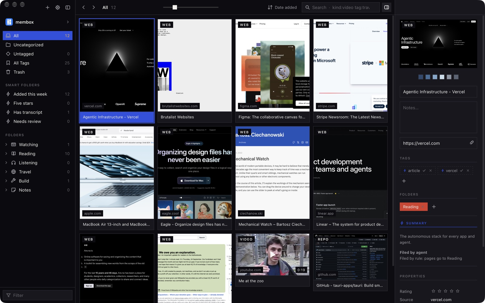
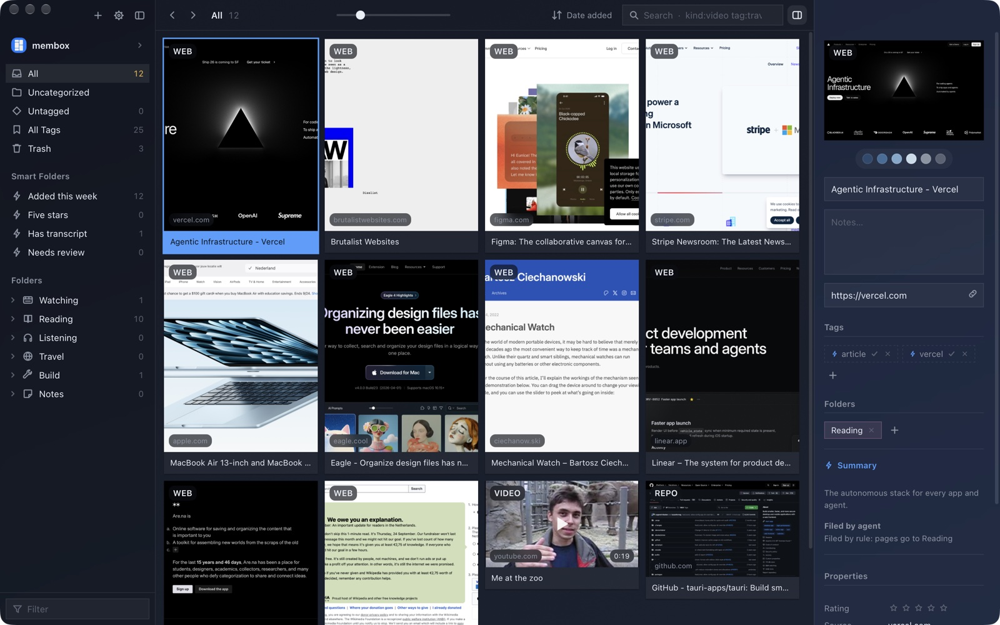

# membox

A local-first visual memory box for macOS, with a companion iPhone viewer.
Paste a link, a video, a reel, a list of books or some styled text, and membox
opens it in its own embedded browser, screenshots it, hands it to the coding
agent you already have installed to tag and file, and lets you find it again
by searching or asking.

Think [Eagle](https://eagle.cool), but you never file anything yourself.



<details>
<summary>The same library in the Glass look</summary>


</details>

Every bookmark tool dies of filing. You save a hundred things, tag twelve, and
stop opening the app. membox takes the filing off you: the agent reads the
page, names it, tags it and puts it in a folder, and you correct it when it's
wrong.

- **Capture is manual.** ⌘V, drag and drop, the iOS share sheet, or MCP. The clipboard is read only when you paste.
- **Everything stays on your Mac.** SQLite and FTS5 in your Library folder. membox runs without a server, an account or telemetry.
- **Bring your own agent.** Claude Code, Codex, Gemini CLI, OpenCode, a local Ollama model, or none.
- **Your edits win.** Anything you changed by hand stays as you left it, whatever an agent decides later.

## Install

Download the `.dmg` from the [latest release](../../releases/latest) and drag
membox to Applications. Releases are Developer ID signed and notarized, and
every push to `main` is one. The app checks for a new version every half hour
and offers **Update** in the sidebar.

Optional, for richer captures:

```sh
brew install yt-dlp        # YouTube / Instagram posters, metadata, transcripts
```

…and any one of the agent CLIs in [Agent lanes](#agent-lanes), signed in.

## Build from source

You need macOS 13 or later, stable Rust, Node 22 with Yarn 1, and Xcode for iOS.

```sh
cd desktop && yarn install
bin/dev                          # "membox Dev" window (starts Vite on :5210)
cd desktop && yarn dev           # UI only, in a browser, over a localStorage stand-in
cd desktop && yarn install:app   # build, sign with your keychain identity, install to /Applications
cargo test -p membox-core        # core tests
cd desktop && node --test src/capture.test.js
ios/bootstrap.sh && ios/build.sh # xcframework + Xcode project → simulator (see ios/README.md)
```

`yarn install:app` signs with a Developer ID or Apple Development identity
from your keychain. `APPLE_SIGNING_IDENTITY=-` signs ad-hoc.

### Layout

```
core/      Rust: SQLite + FTS5 store, capture, enrichment queue, agent adapters,
           loopback MCP server, iCloud sync. Shared by desktop and iOS.
desktop/   Tauri v2 + React 19. A hidden second window is the embedded browser.
ios/       SwiftUI over the core via UniFFI, share extension.
brand/     Icon master + bin/icons → every derived set.
bin/       dev · backup · restore · icons · mock-thumbs · version · release-secrets
docs/      Feature-Spec.md, the full spec.
```

### Two identities

| | identity | library |
|---|---|---|
| **membox** | `com.membox.desktop` | `~/Library/Application Support/com.membox.desktop/` |
| **membox Dev** | `com.membox.desktop.dev` (golden DEV badge) | `…/com.membox.desktop.dev/` |

They have separate Dock icons, libraries, MCP endpoints and iCloud folders
(`membox` and `membox-dev`), and both can run at once, so you can break the
Dev one freely. `bin/dev` and `yarn install:app:dev` share the Dev library.

Each library folder holds `membox.db` (SQLite, WAL), `blobs/`
(content-addressed screenshots), `scratch/<item>/` (what each agent run saw
and wrote), `membox.log` and `mcp.json`. `bin/backup` and `bin/restore`
snapshot a library and put it back.

### Releases

Push a `v*` tag and `.github/workflows/release.yml` builds a universal
`.dmg` into a draft GitHub release. The build is signed and notarized when the
repository has these secrets, and ad-hoc signed when it doesn't:
`APPLE_CERTIFICATE` (base64 .p12), `APPLE_CERTIFICATE_PASSWORD`,
`APPLE_SIGNING_IDENTITY`, `APPLE_ID`, `APPLE_PASSWORD` (app-specific), `APPLE_TEAM_ID`.

## How a paste becomes a filed item

Paste anything. A link, a list of links (each becomes its own item), a
bare `youtube.com/watch?v=…`, a share dialog's embed HTML, an image, a
PDF or any file, a block of code, a note. The core works out what each thing
is. You never say.

1. **Capture** (`core/src/capture.rs`) finds every URL in the paste, its canonical
   form, its dedupe key and its kind (video · music · reel · repo · post · image · pdf ·
   page · code · text). Every pasteboard flavour is kept, HTML markup
   verbatim, and the prose around a single link becomes your note on it.
2. **Fetch** (`core/src/enrich.rs`) uses no model. YouTube and Instagram go through
   `yt-dlp` for the poster, metadata and transcript. Everything else loads in the
   embedded WKWebView for readable text and a viewport and full-page PNG.
   Still with no model, `core/src/autotag.rs` derives tags from the kind,
   the site, the channel and the page's own keywords, and a rule files it
   (videos → Watching, music → Listening, repos → Build › Code, pages →
   Reading). Machine tags are drawn dashed, with a ✓ to keep them, until you make
   them yours.
3. **Agent** (`core/src/agent.rs`) gets a scratch dir with `input.json`,
   `readable.md`, `screenshot.png`, a per-agent MCP config pointing at
   membox's loopback server, and `prompt.md`. The CLI runs unattended with a
   hard timeout and writes `result.json`. An existing folder above the confidence
   threshold files the item. A suggested new folder appears as *suggested* in the
   sidebar until you accept it. Your own edits are left alone.
4. **MCP** (`core/src/mcp.rs`) offers `navigate`, `screenshot`, `extract_readable`,
   `extract_links`, `click`, `scroll`, `search`, `get_item`, `set_item`,
   `create_item` and `create_folder`. The server is loopback only with a bearer token per process,
   origin and host checks, an audit line for every call, and writes scoped to the item under
   enrichment.

## iCloud sync

Turn it on under Settings › *Keep this library in sync across my devices* on the
desktop, or in the ⋯ menu on iOS. The SQLite file itself stays on the machine,
because file-level sync of a live database corrupts it. Each device instead writes its own
`devices/<device-id>.json` snapshot into the iCloud folder and merges the
others', last writer wins per row on `updated_at`, and deletions travel as tombstones.
Two devices never write the same file, so iCloud has nothing to conflict
on. Items, folders, tags and thumbnails travel. Full-page shots, transcripts,
scratch dirs and agent runs stay local.

The folder is the app's iCloud container (`iCloud.com.membox`, shown as "membox"
in iCloud Drive) once the signed iOS app has created it, and
`~/Library/Mobile Documents/com~apple~CloudDocs/membox` on the Mac until then. Export
runs about a second after any change. Import runs on open, on app focus on iOS, and every
minute. The code is in `core/src/sync.rs`.

## Agent lanes

Chosen in Settings, and shown there with what leaves the machine:

| lane | binary | sends content to |
|---|---|---|
| `claude` | Claude Code | Anthropic |
| `codex` | Codex | OpenAI |
| `gemini` | Gemini CLI | Google |
| `opencode` | OpenCode | its configured provider |
| `local` | Ollama | nothing, it stays on this machine |
| `off` | none | nothing, capture and screenshot only |

## Privacy

So what leaves your machine? Exactly three things: the pages you paste, fetched
by the embedded browser; the item you are filing, sent to the agent lane you
picked, and nothing at all when that lane is Ollama or off; and your iCloud
Drive if you turn sync on. There is no membox server, no account and no telemetry.

## License

[GPL-3.0-or-later](LICENSE). Use it, change it, ship it, as long as what you
ship is open source too. `core/vendor/autoconsent` is DuckDuckGo's
autoconsent, MPL-2.0, unmodified.
